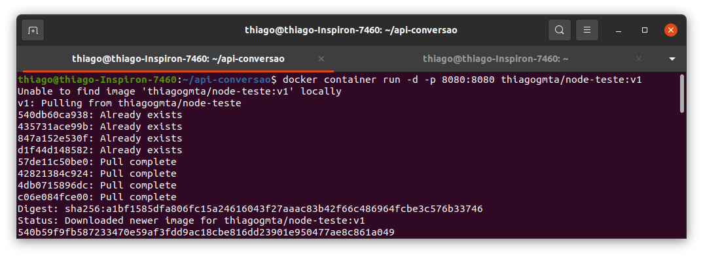
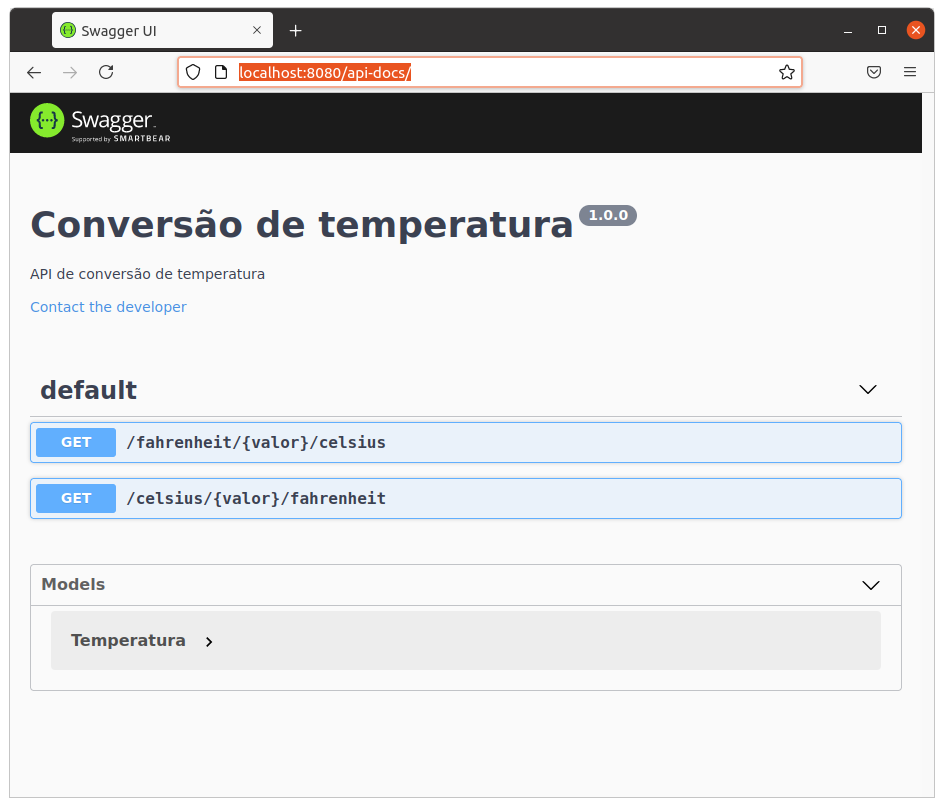

# Executando uma aplicação Node em um Container

> por: Thiago Guimarães Tavares.
>
> Este repositório apresenta um teste derivado do evento: **Kubernetes Bootcamp 2.0 | Aula 01**

O objetivo deste repositório é executar uma aplicação para Conversão de temperatura em um container Docker.

## Requisitos

Para execução deste repositório é necessário ter o Docker instalado. Para instalação do Docker consulte a documentação oficial disponível [aqui](https://docs.docker.com/get-docker/).

## Executando

Em seu terminal execute o comando:

```bash
$ docker container run -d -p 8080:8080 thiagogmta/node-teste:v1
```



O docker irá fazer o download da imagem do container disponível no Dockerhub. Após o processo abra seu navegador de internet e digite: `http://localhost:8080/api-docs/` a aplicação será exibida:



## Compreendendo:

Os arquivos deste repositório consistem nos códigos fonte desta aplicação. O arquivo **Dockerfile** compreende no arquivo que contém as instruções para a criação da imagem. Para tal utilizei como base uma imagem do `node`. Para criação da imagem utilizei o comando:

```bash
$ docker image build -t thiagogmta/node-teste:v1 .
```

e posteriormente enviei ao Dockerhub com o comando:

```bash
$ docker push thiagogmta/node-teste:v1
```

*see ya...*